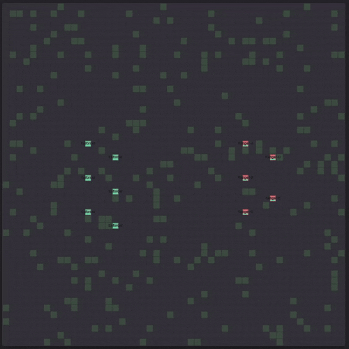

# Screeps Arena Combat Simulator

Offline combat simulator for Screeps Arena. Test squad compositions, run tournaments, and figure out what actually works before you deploy.



## Getting Started

```bash
npm install
npm test
```

This runs a quick test of predefined scenarios. Want to try something else?

```bash
npm run test:random    # Generate random squads and fight them

npm run test:elo       # Run a full ELO tournament

npm run test:ranged    # Test your ranged kiting strategy
```

## How it works

The simulator reimplements Arena's combat mechanics: damage, healing, ranged falloff, swamp movement, body part destruction. You define squad compositions, the engine runs battles until one side is eliminated, and you get win rates and statistics back.

Four modes available:

**quick** - Compare a handful of predefined scenarios
**random** - Generate random compositions and fight them
**elo** - Run a tournament and calculate ELO ratings
**predefined** - Test a specific scenario against others

```bash
node runner.mjs --mode elo --compositions 50 --battles 500
node runner.mjs --mode predefined --scenario ranged_kite --battles 100 -v
```

Options: `--mode`, `--battles`, `--compositions`, `--scenario`, `--verbose`, `--help`

## Scenarios

The simulator comes with a few basic scenarios (`ranged_kite`, `heavy_melee`, `hybrid_squad`, `current_strategy`). Add your own in `scenarios/scenario-generator.mjs`:

```javascript
'custom_squad': [
    { body: [MOVE, ATTACK, MOVE, ATTACK], role: 'Attacker' },
    { body: [MOVE, HEAL, MOVE], role: 'Medic' }
]
```

Then test it:

```bash
node runner.mjs --mode predefined --scenario custom_squad
```

## Combat mechanics

The simulator implements the real Arena rules:

**ATTACK** does 30 damage per part (melee only, range 1).

**RANGED_ATTACK** does 10 damage base, with falloff: 100% at range 0-1, 40% at range 2, 10% at range 3.

**HEAL** restores 12 HP per part when adjacent, or 4 HP per part at range 1-3.

**Movement** in swamp costs 10 fatigue per move, reduced by 2 per MOVE part. You need 1 MOVE per 2 body parts to move every tick.

Body parts have 100 HP each. Damage goes front-to-back through the body array. Dead parts stop working.
